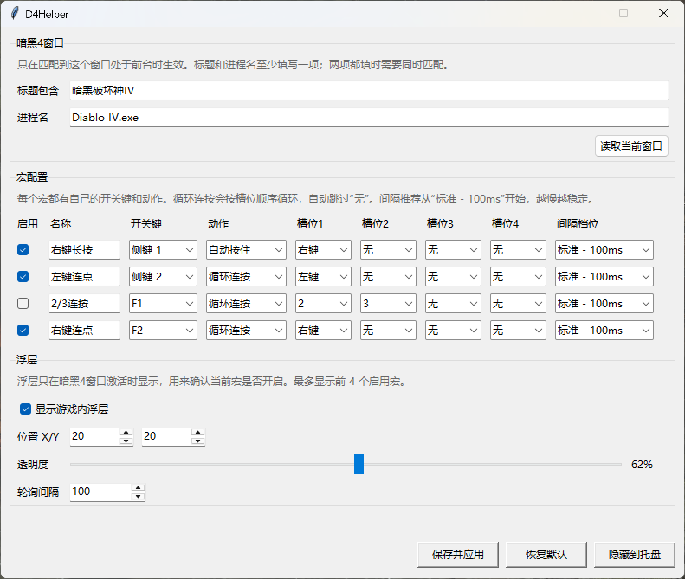
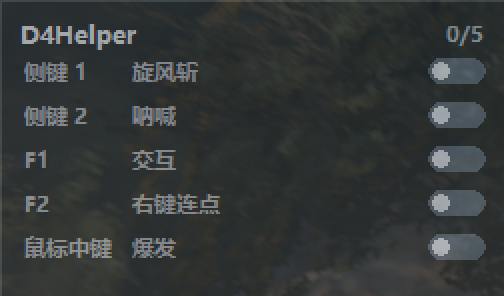

# D4Helper

D4Helper 是一个针对《暗黑破坏神 IV》的 Windows 轻量辅助工具，用来减少重复按键和长按操作带来的疲劳。

它不是通用宏编辑器，而是面向暗黑 4 的简单宏开关工具：只在配置的游戏窗口处于前台时生效，窗口失焦后会自动释放长按并停止循环。

## 默认行为

- 侧键 1：切换旋风斩，自动按住右键。
- 侧键 2：切换呐喊，每 500ms 短按 `1`。
- F1：切换交互，循环短按 `F`。
- F2：切换右键连点。
- 鼠标中键：切换爆发，循环短按 `2 -> 3`。
- E：一键启动或关闭旋风斩、呐喊、交互。
- 游戏内浮层显示每个启用宏的开关键、名称和开关状态。

## 截图

配置页面：



游戏内浮层：



## 运行

```powershell
.\dist\D4Helper.exe
```

拷贝到其他 Windows 电脑时，把这些文件放在一起：

```text
D4Helper.exe
config.json
VERSION
```

## 使用教程

1. 启动暗黑 4，并进入游戏窗口。
2. 启动 `D4Helper.exe`。
3. 在配置页面点击“读取当前窗口”，让工具记录暗黑 4 的窗口标题和进程名。
4. 按需要调整宏的开关键、动作、目标按键和连按间隔。
5. 如果需要同时开关多个宏，可以在“一键启动”里选择快捷键和要控制的宏。
6. 点击“保存并应用”，配置会立即生效并写入 `config.json`。
7. 回到暗黑 4，使用配置好的开关键开启或关闭对应宏。
8. 不需要显示配置页面时，可以关闭窗口或最小化到托盘，程序会继续在后台运行。

默认配置按当前截图中的配置提供，适合先直接试用：

- 侧键 1 开启或关闭旋风斩，自动按住右键。
- 侧键 2 开启或关闭呐喊，每 500ms 短按 `1`。
- F1 开启或关闭交互，循环短按 `F`。
- F2 开启或关闭右键连点。
- 鼠标中键开启或关闭爆发，循环短按 `2 -> 3`。
- E 一键开启或关闭旋风斩、呐喊、交互。

浮层会显示当前启用宏的开关键、名称和开关状态。鼠标移动到浮层区域时，浮层会临时避让，避免遮挡游戏操作。

## 宏配置

工具支持添加、删除多个宏。每个宏都可以单独设置：

- 是否启用
- 名称
- 开关键
- 动作
- 循环槽位
- 连按间隔

开关键以录制为主。每个开关键显示框右侧都有“录”和“选”按钮：

- 录：点击后按一次目标键即可录入。
- 选：从常用键里快速选择。

常用开关键：

- 侧键 1
- 侧键 2
- 鼠标中键
- F1-F12
- 数字 0-9
- 字母 A-Z
- 空格、Tab、Enter、Backspace
- Shift、Ctrl、Alt、CapsLock
- Insert、Delete、Home、End、PageUp、PageDown
- 方向键

可选动作：

- 无
- 自动按住
- 循环连按

槽位支持：

- 无
- 左键
- 右键
- 鼠标中键
- 数字 0-9
- 字母 A-Z
- F1-F12
- 空格、Tab、Enter、Backspace
- Shift、Ctrl、Alt、CapsLock
- Insert、Delete、Home、End、PageUp、PageDown
- 方向键

每个槽位显示框右侧也有“录”和“选”按钮。录入按键时，按 Esc 可以取消。左键可以作为槽位动作使用，但不能作为宏开关键，避免点击界面时误触发。

### 自动按住

`自动按住` 只使用槽位 1。

例如：

```text
动作：自动按住
槽位 1：右键
```

表示按一次开关键后自动按住右键，再按一次开关键后释放右键。

### 循环连按

`循环连按` 会按照槽位顺序触发，并自动跳过“无”。

例如：

```text
2 / 3 / 无 / 无
```

会循环：

```text
2 -> 3 -> 2 -> 3
```

连按间隔：

- 手动输入毫秒数，默认 100ms。
- 最低不能小于 25ms。
- 建议先使用 100ms；如果游戏内出现漏按，可以适当调高到 150ms、250ms 或更慢。

## 一键启动

“一键启动”用于用一个快捷键同时控制多个宏。

每一行一键启动配置包含：

- 是否启用
- 快捷键
- 要控制的宏
- 删除操作

默认一键启动快捷键是 E，控制旋风斩、呐喊、交互。按一次会开启这组宏；当这组宏都处于开启状态时，再按一次会关闭它们。

未勾选启用的一键启动配置不会响应快捷键，也不会参与快捷键冲突检查。旧版本配置没有启用字段时，会自动按“启用”处理。

## 界面

主配置窗口包含：

- 宏配置
- 一键启动
- 支持与反馈

窗口匹配、浮层位置、轮询间隔和版本更新入口收在“高级设置”和菜单里。打开暗黑 4 后点击“读取当前窗口”，可以自动填入窗口标题和进程名。

浮层会显示启用宏的开关键、名称、图形开关状态和当前开启数量。浮层高度会根据启用宏数量自动计算。鼠标移动到浮层区域时，浮层会临时避让；鼠标离开后会回到原位置。切换出游戏窗口时，程序会释放长按、停止循环并清理宏状态，降低输入状态残留的风险。

配置窗口标题栏会显示当前版本号，例如：

```text
D4Helper v1.5.0
```

“版本更新”区域可以手动检查 GitHub Release 是否有新版本。发现新版后，点击“查看更新”会打开 Release 页面，由用户自行决定是否下载更新；程序不会自动下载或替换 exe。

## 打包

```powershell
python -m pip install pyinstaller pystray pillow
.\build.ps1
```

输出：

```text
dist\D4Helper.exe
dist\config.json
dist\VERSION
```

版本号记录在 [VERSION](VERSION)。

本地构建会读取 `VERSION`，并把版本写入：

```text
dist\VERSION
```

同时，构建脚本也会把 `VERSION` 打进 exe 内部。运行时版本号读取顺序为：

1. exe 同目录的 `VERSION`
2. exe 内置的 `VERSION`
3. 读取失败时显示 `unknown`

## GitHub Actions

仓库包含自动打包流程：

```text
.github/workflows/build.yml
```

触发方式：

- push 到 `main` 或 `master`
- pull request
- 手动运行 workflow
- push `v*` 标签，例如 `v0.1.0`

每次构建会上传 artifact：

```text
D4Helper-windows-latest
```

推送 tag 时会自动创建 GitHub Release，并上传：

```text
D4Helper-windows-latest.zip
```

静态展示页使用固定文件名下载最新版本：

```text
https://github.com/indiefun/d4-helper/releases/latest/download/D4Helper-windows-latest.zip
```

国内加速下载使用第三方 GitHub 代理前缀；如果代理不可用，请使用 GitHub Release。

## 版本升级与发布

发布新版本时：

1. 修改 [VERSION](VERSION)，例如改成 `0.2.0`。
2. 提交版本号和代码改动。
3. 创建与 `VERSION` 对应的 tag，格式必须是 `v版本号`。
4. 推送 tag。

示例：

```powershell
git add VERSION README.md
git commit -m "Bump version to 0.2.0"
git tag v0.2.0
git push
git push origin v0.2.0
```

GitHub Actions 会校验 tag 和 [VERSION](VERSION) 是否匹配。例如 `VERSION` 是 `0.2.0` 时，tag 必须是 `v0.2.0`。

## 注意

- 如果暗黑 4 以管理员权限运行，本工具也需要以管理员权限运行。
- 部分反作弊或安全策略可能会阻止模拟输入。
- 通过托盘菜单退出时，程序会释放已按住的鼠标和键盘按键。
- 程序只允许同时运行一个实例。多开会导致多个宏引擎同时模拟输入，可能造成按键状态混乱。
- 如果切换窗口后出现鼠标能动但无法点击的异常状态，优先检查托盘里是否残留多个 D4Helper，并全部退出后重新启动。

## 支持与反馈

如果这个工具对你有帮助，可以扫码打赏支持。打赏是完全自愿的，不影响任何功能。

遇到问题、想反馈建议，或想交流配置方案，可以加入 QQ 交流群：

```text
958154728
```


## 许可证

本项目使用 MIT License，详见 [LICENSE](LICENSE)。
